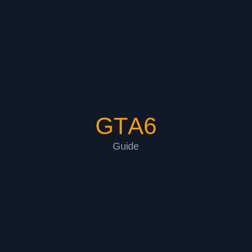

# GTA6 游戏攻略网站



GTA6 游戏攻略网站 - 基于 GitHub Pages 的静态网站，支持中英文切换。

## 功能特性

- ✅ React 18 + TypeScript + Vite
- ✅ react-i18next 中英文切换
- ✅ Markdown 内容渲染（react-markdown + gray-matter）
- ✅ 广告位配置（ads.json）
- ✅ GitHub Pages 部署（gh-pages）
- ✅ 响应式布局（桌面端 + 移动端）
- ✅ SEO 优化（React Helmet Async）
- ✅ 搜索功能（P2 功能）

## 技术栈

| 技术 | 版本 | 用途 |
|------|------|------|
| React | ^18.2.0 | UI 框架 |
| TypeScript | ^5.2.2 | 类型安全 |
| Vite | ^5.0.0 | 构建工具 |
| React Router | ^6.20.0 | 路由管理 |
| react-i18next | ^13.5.0 | 国际化 |
| gray-matter | ^4.0.3 | Markdown Front Matter 解析 |
| react-markdown | ^9.0.1 | Markdown 渲染 |

## 项目结构

```
gta6-guide/
├── .github/workflows/    # GitHub Actions 配置
├── public/               # 静态资源
├── content/guides/       # Markdown 攻略文件
├── src/
│   ├── components/       # 可复用组件
│   ├── config/           # 配置文件
│   ├── i18n/            # 国际化文件
│   ├── pages/           # 页面组件
│   ├── hooks/           # 自定义 Hooks
│   ├── types/           # TypeScript 类型定义
│   └── utils/           # 工具函数
└── package.json
```

## 快速开始

### 安装依赖

```bash
npm install
```

### 本地开发

```bash
npm run dev
```

访问 `http://localhost:5173/gta6-guide/` 查看网站。

### 构建生产版本

```bash
npm run build
```

### 部署到 GitHub Pages

```bash
npm run deploy
```

## 内容管理

### 添加新攻略

1. 在 `content/guides/` 目录下创建新的 Markdown 文件
2. 添加 Front Matter（YAML 格式）
3. 提交并推送到 GitHub

#### Front Matter 格式示例

```markdown
---
title: "攻略标题"
description: "SEO 描述"
date: 2026-05-10
updated: 2026-05-15
tags: [标签1, 标签2]
category: tips
coverImage: /images/guides/cover.webp
author: 作者名
lang: zh
slug: guide-slug
---

# 攻略标题

攻略内容...
```

## 广告管理

编辑 `src/config/ads.json` 配置广告位：

```json
{
  "enabled": true,
  "ads": [
    {
      "id": "ad-001",
      "position": "hero",
      "type": "banner",
      "title": "广告标题",
      "imageUrl": "https://example.com/ad.png",
      "linkUrl": "https://example.com",
      "enabled": true
    }
  ]
}
```

## i18n 国际化

翻译文件位于 `src/i18n/` 目录：

- `zh/common.json` - 中文通用翻译
- `en/common.json` - 英文通用翻译
- `zh/navigation.json` - 中文导航翻译
- `en/navigation.json` - 英文导航翻译

## 脚本命令

| 命令 | 说明 |
|------|------|
| `npm run dev` | 启动开发服务器 |
| `npm run build` | 构建生产版本 |
| `npm run preview` | 预览生产版本 |
| `npm run deploy` | 部署到 GitHub Pages |
| `npm run lint` | 运行 ESLint |
| `npm run format` | 格式化代码 |

## 部署

### GitHub Pages 自动部署

1. Fork 或克隆此仓库
2. 在仓库设置中启用 GitHub Pages
3. 选择 GitHub Actions 作为部署源
4. 推送到 `main` 或 `master` 分支自动部署

### 手动部署

```bash
npm run deploy
```

## 贡献指南

欢迎贡献！请遵循以下步骤：

1. Fork 此仓库
2. 创建特性分支 (`git checkout -b feature/AmazingFeature`)
3. 提交更改 (`git commit -m 'Add some AmazingFeature'`)
4. 推送到分支 (`git push origin feature/AazingFeature'`)
5. 开启 Pull Request

## 许可证

MIT License

## 联系方式

- 邮箱：contact@gta6guide.com
- GitHub：[GTA6 Guide](https://github.com/yourusername/gta6-guide)

---

**免责声明**：本网站为粉丝创作的非官方网站，与 Rockstar Games 没有任何关联。
